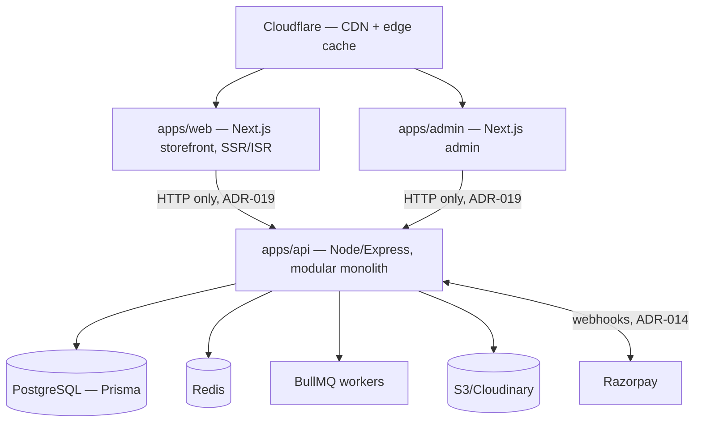
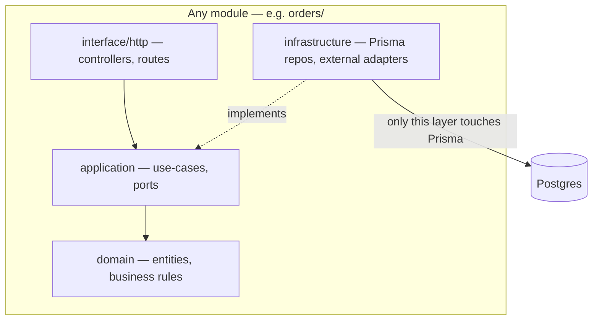
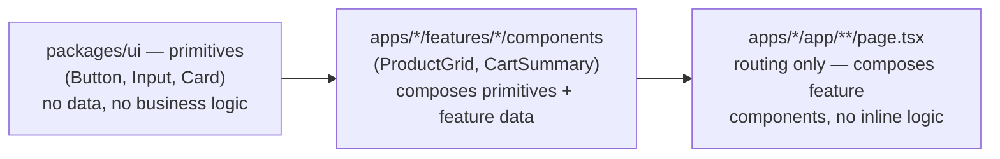

# Woobe — ARCHITECTURE.md

This supersedes the high-level `ARCHITECTURE.md` stub from initial setup with the actual folder structure, module boundaries, and component model. Read alongside `PLAN.md` (ADR-001–020) — this document is about *structure*; `PLAN.md` is about *decisions*. Where they'd conflict, `PLAN.md`'s ADRs win.

---

## 1. System Overview



Both Next.js apps are clients of the API, full stop — including during SSR. Nothing outside `apps/api` touches Postgres. This is ADR-019, and it's the single most load-bearing rule in this document: it's what keeps "server-authoritative pricing" actually true rather than true-in-theory.

---

## 2. Monorepo Structure (top level)

```
Woobe-ecommerce/
├── apps/
│   ├── web/        # customer storefront — Next.js, SSR/ISR
│   ├── admin/       # admin app — Next.js
│   └── api/          # Node.js/Express — all business logic, all DB access
├── packages/
│   ├── database/    # Prisma schema + client (imported ONLY by apps/api)
│   ├── types/         # shared TS types, mostly derived from packages/validation
│   ├── validation/     # Zod schemas — single source of truth, client + server (ADR-020)
│   ├── ui/               # design tokens + primitives, component-based (§4)
│   ├── config/             # shared eslint/tsconfig/tailwind config
│   └── utils/               # pure helpers — money/weight conversion, etc.
├── docs/
├── docker/
└── .github/workflows/
```

---

## 3. Backend: Modular Monolith + Clean Architecture

### 3.1 Layering (per module)



`domain` has zero framework dependencies — no Express, no Prisma, testable in isolation. `application` orchestrates use-cases and depends on `domain` plus *interfaces* (ports) it doesn't implement. `infrastructure` implements those ports — this is the **only** place a module's Prisma models get imported (ADR-010, enforced by `dependency-cruiser` in CI, not convention). `interface/http` is thin — parses the request, calls a use-case, maps the result to a response.

### 3.2 Full example — `auth` module (every other module follows this exact shape)

```
apps/api/src/modules/auth/
├── domain/
│   ├── entities/
│   │   └── user.entity.ts
│   └── errors/
│       └── invalid-credentials.error.ts
├── application/
│   ├── use-cases/
│   │   ├── register-user.use-case.ts
│   │   ├── login-user.use-case.ts
│   │   ├── refresh-token.use-case.ts
│   │   └── logout-user.use-case.ts
│   └── ports/
│       └── auth-repository.port.ts       # interface — application depends on this, not Prisma
├── infrastructure/
│   ├── repositories/
│   │   └── auth.repository.ts            # ONLY file importing User/AuthCredential Prisma models
│   └── services/
│       ├── bcrypt.service.ts
│       └── jwt.service.ts
├── interface/
│   └── http/
│       ├── auth.controller.ts
│       └── auth.routes.ts
└── auth.module.ts                         # composition root — wires use-cases to repos to routes
```

### 3.3 Every module, same pattern

`products, categories, collections, pricing, inventory, cart, wishlist, coupons, orders, payments, shipping, reviews, returns, refunds, notifications, admin` — each gets the identical `domain / application / infrastructure / interface / <name>.module.ts` shape. Two worth calling out:

- **`pricing`** — the weight→price formula lives in `domain` as a pure function. No I/O, no Prisma. This is why it's trivially unit-testable and why "never trust the client for price" is enforceable — there's exactly one function that computes price, and it's not reachable from outside this module except through the `application` layer.
- **`orders`** — owns the order state machine (`PLAN.md` §4) in `domain`. Other modules (`payments`, `returns`) trigger transitions by calling `orders`' use-cases through its `ports` — they never write to the `Order` table themselves, even though they're "related" domains.

### 3.4 Top-level `apps/api/src`

```
apps/api/src/
├── config/          # env validation (zod, fail fast), db/redis/razorpay client setup, queue definitions
├── middleware/       # auth-guard, rbac-guard, error-handler, request-id, rate-limiter, validate (uses packages/validation)
├── shared/             # DomainError hierarchy, Result<T,E> type — used by all modules, owns NO database access
├── modules/              # §3.2–3.3
├── app.ts                 # express() instance, mounts every module's routes
└── server.ts               # bootstrap, graceful shutdown
```

`shared/` is deliberately narrow — cross-cutting types and error classes only. If something in `shared/` starts needing Prisma, it's actually module-specific and belongs in that module's `infrastructure`, not here.

---

## 4. Frontend: Component-Based Architecture

Three tiers, one-way dependency (apps depend on packages, never the reverse):



### 4.1 `packages/ui` — design system

```
packages/ui/src/
├── tokens/          # colors.ts, typography.ts, spacing.ts — from frontend-design plugin
├── primitives/       # Button, Input, Badge, Card, Spinner, Modal — domain-agnostic, no fetching
├── components/         # PriceTag, RatingStars, ImageCarousel — composed but still domain-agnostic
├── layouts/               # PageShell, MobileNav, AdminSidebar
└── index.ts
```

Rule: nothing in `packages/ui` imports from `apps/*`. It knows nothing about products, carts, or orders — only about buttons, cards, and spacing.

### 4.2 `apps/web` — feature-based, mirrors backend domains

```
apps/web/src/
├── app/                                # Next.js App Router — ROUTING ONLY
│   ├── (storefront)/
│   │   ├── page.tsx                    # homepage — composes feature components
│   │   ├── products/[slug]/page.tsx
│   │   ├── category/[slug]/page.tsx
│   │   ├── cart/page.tsx
│   │   ├── checkout/page.tsx
│   │   ├── order-confirmation/[id]/page.tsx
│   │   ├── account/{page.tsx, orders/page.tsx}
│   │   ├── login/page.tsx
│   │   └── register/page.tsx
│   └── layout.tsx
├── features/
│   ├── auth/        {components/ (LoginForm, RegisterForm), hooks/ (useAuth, useSession), api/ (auth.client.ts)}
│   ├── catalog/       {components/ (ProductGrid, ProductDetail, VariantSelector), hooks/, api/}
│   ├── cart/            {components/ (CartList, CartSummary), hooks/ (useCart), api/}
│   └── checkout/           {components/ (AddressForm, PaymentMethodSelector, OrderSummary), hooks/, api/}
├── lib/
│   ├── api-client.ts    # base fetch wrapper — auth header, error normalization. The ONLY thing that talks to apps/api
│   └── formatters.ts      # display formatting, built on packages/utils
└── hooks/                    # truly global only (useDebounce, useMediaQuery)
```

Each feature's `api/*.client.ts` is a typed wrapper around `lib/api-client.ts` — this is the sole path data takes from the API into a component. A page file (`app/**/page.tsx`) may only compose feature components and call feature hooks; it does not fetch data or hold business logic inline.

`apps/admin` mirrors this exactly — `features/{product-management, order-management, inventory, returns-review}` — built out from Week 2 onward, same rules apply.

---

## 5. Reliability — how the structure earns it, not just claims it

| Mechanism | Where |
|---|---|
| Business logic isolated from framework code, independently testable | Clean Architecture `domain` layer (§3.1) |
| No accidental cross-module coupling | `dependency-cruiser` boundary check in CI (ADR-010) |
| API/UI contract can't silently drift | Shared Zod schemas, client + server (ADR-020) |
| Safe retries, no duplicate financial effects | Idempotency on checkout/payment/webhook/refund (`PLAN.md` §6, ADR-014) |
| Correct under concurrent access | Row-level locking in `inventory`'s infrastructure layer (ADR-015) |
| No inconsistent state from unhandled errors | Central `error-handler` middleware + `Result<T,E>` pattern |
| Nothing broken merges | CI gate: lint, typecheck, test, migration-safety check (ADR-013) |

---

## 6. Scalability — how the structure earns it

| Mechanism | Where |
|---|---|
| Horizontally scalable API | Stateless (JWT, no server-side session state) — matches `PLAN.md` §12's future load-balanced diagram |
| Multiple API instances stay consistent | Redis for shared cache/rate-limit state, not in-process memory |
| Background work doesn't block requests | BullMQ workers, scale independently of the API process |
| Read-heavy storefront traffic served at the edge | Cloudflare CDN + Next.js ISR (ADR-017) |
| Clean extraction seam if one module outgrows the monolith | Module boundaries (ADR-010) — extract `inventory` or `orders` alone if it's the one under load |
| Read replica is a config change, not a rewrite | All queries go through a module's `infrastructure/repositories` — one place to point at a replica later |

---

## 7. Package/App Responsibility Table

| Path | Owns |
|---|---|
| `apps/web` | Customer storefront UI. No business logic, no DB access (ADR-019). |
| `apps/admin` | Admin UI. Same rule. |
| `apps/api` | All business logic, all DB access, all external integrations (Razorpay, S3). |
| `packages/database` | Prisma schema + client. Imported only by `apps/api`. |
| `packages/types` | Shared TS types, mostly `z.infer` from `packages/validation`. |
| `packages/validation` | Zod schemas — single source of truth for request shapes (ADR-020). |
| `packages/ui` | Design tokens + primitives. Domain-agnostic. |
| `packages/utils` | Pure functions — money/weight conversion, no side effects. |
| `packages/config` | Shared lint/TS/Tailwind config. |