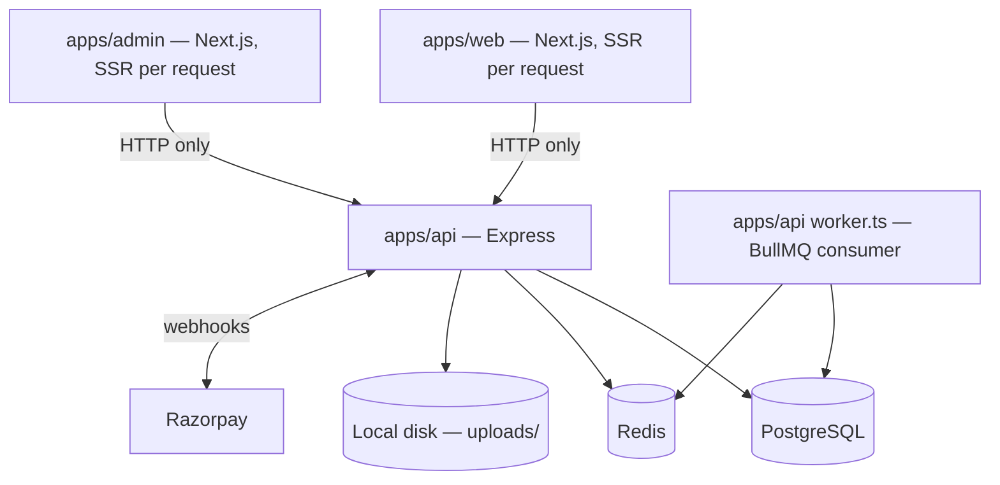
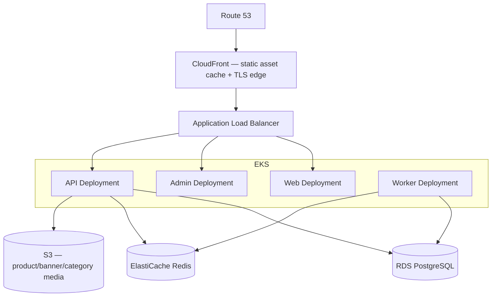

# Woobe — AWS Deployment Plan

**Status:** discovery/planning only — nothing in this document has been built yet. No Dockerfiles, Terraform, Kubernetes manifests, or AWS resources exist as of this writing (2026-09-06). This is the repository-grounded architecture map and staged rollout plan to work from once implementation starts.

Read alongside `architecture.md` (module structure) and `plan.md` (ADRs) — this document is about *where it runs*, not *how it's built*.

---

## 1. Current Architecture (as built)

pnpm workspace monorepo, Node ≥22, pnpm 11.23.

```
apps/
  web    → @woobe/web    — Next.js 15.5 / React 19 storefront, port 3000
  admin  → @woobe/admin  — Next.js 15.5 / React 19 admin console, port 3001
  api    → @woobe/api    — Express 4.21 REST API, port 4000, + a separate BullMQ worker process
packages/
  database → @woobe/database — Prisma schema/client, imported ONLY by apps/api (ADR-019)
  types / validation / ui / utils / config — shared, no runtime footprint of their own
```



Both Next.js apps talk to `apps/api` **only over HTTP** — neither imports Prisma or reads Postgres directly (verified: no `cookies()` reads, no server-side DB access anywhere in `apps/web`/`apps/admin`). Auth is stateless JWT (access token in memory, refresh token in an httpOnly DB-backed cookie); cart identity is a DB-backed cart row keyed by a signed cookie; inventory locking is Postgres `SELECT ... FOR UPDATE` inside a transaction. None of this is process-local state — this is a clean, already-horizontally-scalable design with one exception (§2).

### Runtime services

| Component | Code Location | Runtime | Port | Stateful? | External Dependencies |
|---|---|---|---|---|---|
| Web (storefront) | `apps/web` | `next start` | 3000 | No | `apps/api` over HTTP |
| Admin console | `apps/admin` | `next start` | 3001 | No | `apps/api` over HTTP |
| API server | `apps/api/src/server.ts` | `node dist/server.js` | 4000 | No | Postgres, Redis, Razorpay, SMTP (optional) |
| Notification worker | `apps/api/src/worker.ts` | separate `node dist/worker.js` process | — (no HTTP) | No | Postgres, Redis, SMTP (optional) |
| Postgres | dev: `docker-compose.yml` | Postgres 16 | 5433 (dev) | Yes | — |
| Redis | dev: `docker-compose.yml` | Redis 7 | 6380 (dev) | Yes (fully disposable — cache/queue/rate-limit only) | — |
| Local disk media | `LocalDiskMediaStorage` | filesystem under API's `cwd` | — | **Yes — blocker, see §2** | — |

---

## 2. The One Real Blocker: Media on Local Disk

`apps/api/src/modules/media/infrastructure/storage/local-disk-media-storage.service.ts` writes uploaded product/banner/category images to `MEDIA_UPLOAD_DIR` (default `uploads/`) with `fs.writeFile`, served back via `express.static("/uploads")`. It's the **only filesystem writer** in the codebase.

This is fine for a single process, but breaks the moment there's more than one API replica (upload lands on replica A, invisible to replica B) or the container is ephemeral (lost on every redeploy/restart).

**Good news:** it was already built behind a `MediaStoragePort` interface specifically for this swap — its own doc comment says as much. Fixing this is one new class (`S3MediaStorage implements MediaStoragePort`) wired into `media.module.ts`'s composition root; nothing in `application`/`interface` changes.

**This is a prerequisite for any multi-replica deployment of the API — Stage 0 in the roadmap (§7), before Docker, before AWS.**

Nothing else in the codebase holds process-local state:
- Redis usage (rate limiting, one BullMQ queue, catalog display cache, guest-order-claim limiter) is verified to fail open — a live test (`journal.md`) stopped Redis mid-session and every catalog endpoint kept returning 200s.
- No structured session store — auth is stateless JWT + DB-backed refresh tokens.
- No sticky-session requirement anywhere (no server-side `cookies()` read in either Next.js app).

---

## 3. Next.js Deployment Reality

**Neither `apps/web` nor `apps/admin` can be statically exported.** `apps/web/app/(storefront)/page.tsx` explicitly sets `export const dynamic = "force-dynamic"` (ADR-026) — the homepage, PLP, PDP, cart, checkout, account, and admin pages all fetch live catalog/pricing/order data from `apps/api` at request time. `next build` requires a *running* API to even statically analyze these routes; ADR-026 documents hitting `ECONNREFUSED` when that assumption was violated. Static export (`output: "export"`) is incompatible with this app as built.

**What CAN live in S3/CloudFront:** the Next.js static build output (`_next/static/*`) as a CDN-cached asset tier in front of the app server — not the app itself. Product/banner/category images already bypass Next.js entirely (deliberate: plain `` tags, not `next/image`, because image URLs are arbitrary admin-entered values with no fixed host to allowlist) — so image serving is a separate concern from the Next.js deployment question.

**Conclusion:** rejects the `frontend → S3 / backend → EC2` split floated during discovery. Both Next.js apps need a running Node server per request, same as the API — they belong in the same compute tier (containers on EKS), not in static hosting.

---

## 4. Recommended AWS Target Architecture



- **Web / Admin / API** — each its own stateless Kubernetes Deployment, HPA on CPU (watch p95 latency too for the API, since it's I/O-bound against Postgres, not purely CPU-bound).
- **Worker** — separate Deployment, no Service (it consumes a BullMQ queue, serves no HTTP). Already designed to be replica-safe: `jobId`-based BullMQ de-dup plus a DB-level PENDING-status idempotency check in the use-case itself. Scale on queue depth if volume ever justifies >1 replica; today's default concurrency-1/single-replica is correct.
- **RDS PostgreSQL**, not Aurora and not Postgres-in-Kubernetes — a stateful database inside a cluster you're still learning to operate is the wrong place to take that risk, and Aurora's premium isn't justified at current scale (15 seeded products, no live traffic yet). Single-AZ to start, Multi-AZ at Stage 13 (production).
- **ElastiCache Redis**, single node, no cluster mode — usage is disposable cache/queue/rate-limit data, doesn't need sharding.
- **S3** for product/banner/category media, replacing local disk (§2) — the actual, current use of the media module. No export/backup feature exists yet to plan storage for.

---

## 5. VPC Design

```
VPC (e.g. 10.0.0.0/16), 2–3 AZs

Public subnets       — ALB, NAT Gateway
Private app subnets  — EKS worker nodes (Web/API/Worker pods)
Private db subnets   — RDS, ElastiCache

IGW → public subnets
NAT (public subnet) → private subnets' outbound (image pulls, Razorpay/SMTP calls)

Security groups:
  ALB SG:      inbound 443 from 0.0.0.0/0
  EKS node SG: inbound from ALB SG only
  RDS SG:      inbound 5432 from EKS node SG only
  Redis SG:    inbound 6379 from EKS node SG only
```

RDS and ElastiCache are never publicly reachable — extends the current dev-mode CORS-allowlist posture (`WEB_ORIGIN`/`ADMIN_ORIGIN`) to the network layer.

---

## 6. Terraform / Kubernetes / CI Responsibility Split

```
infrastructure/
└── terraform/
    ├── modules/
    │   ├── vpc/  eks/  rds/  elasticache/  ecr/  s3/  iam/
    └── environments/
        ├── dev/  staging/  production/     ← separate directories, not `terraform workspace`
```

Separate environment directories (not workspaces) — workspaces share backend state config, making a wrong-environment `apply` too easy while still learning the tool. Remote state: one S3-backed state file per environment, DynamoDB table for locking.

| Owns | Layer |
|---|---|
| VPC, EKS cluster/nodes, RDS, ElastiCache, S3, ECR, IAM, Route 53, ACM | **Terraform** |
| Deployments, Services, Ingress, ConfigMaps, Secret values, HPA, PDBs | **Kubernetes** |
| build → test → lint → image build → ECR push → deploy trigger | **CI/CD** |

One justified exception: cluster-lifecycle-coupled add-ons (Cluster Autoscaler, AWS Load Balancer Controller, External Secrets Operator) are commonly provisioned via Terraform's `helm_release` even though they ship as Kubernetes manifests — keep this exception narrow, don't let it creep into deploying `web`/`api`/`worker` themselves.

---

## 7. Staged Roadmap

Ordered so the one code blocker (§2) and containerization happen before any AWS networking work, and multi-replica correctness is proven incrementally, not assumed.

| Stage | What's built | Verification | Rollback |
|---|---|---|---|
| **0 — Local architecture cleanup** | `S3MediaStorage implements MediaStoragePort`, wired into `media.module.ts` | Upload an image, confirm it's fetchable from S3, confirm the DB `key` survives a restart | Revert to `LocalDiskMediaStorage` — no AWS touched yet |
| **1 — Dockerize** | Dockerfiles for `web`, `admin`, `api`/`worker` (shared image, different `CMD` — same `dist/` build artifact) | `docker compose up` reproduces current dev flow | Delete Dockerfiles, no AWS touched |
| **2 — AWS networking + IAM** | VPC, subnets, security groups, IAM roles (Terraform) — no compute yet | `terraform plan`/`apply` succeeds, resources visible, no traffic flowing | `terraform destroy` on an empty environment |
| **3 — EC2 learning environment** | Dockerized API on one EC2 instance, no ALB/EKS yet | `curl /health` from outside the VPC | Terminate the instance |
| **4 — Managed DB/cache/storage** | RDS, ElastiCache, S3 bucket; point Stage-3 EC2 at them | Full checkout flow against managed services, not local dev | Point back at local dev services |
| **5 — EKS cluster** | Cluster + Managed Node Group, no workloads yet | `kubectl get nodes` healthy across AZs | `terraform destroy` the cluster |
| **6 — Kubernetes workloads** | Deployments/Services for all four processes, ConfigMaps/Secrets via External Secrets Operator | Pods Running, `/health` via port-forward. **Also add a real `/ready` endpoint here** (current `/health` doesn't check Postgres/Redis — fine as liveness, not as readiness) | `kubectl delete` the Deployments |
| **7 — ALB/Ingress** | AWS Load Balancer Controller, host-based routing | Domain resolves to each app through the ALB | Remove the Ingress |
| **8 — HPA** | CPU-based autoscaling on `web`/`api` | Load-test, watch replica count climb and settle | Remove the HPA object |
| **9 — Node autoscaling** | Cluster Autoscaler (not Karpenter yet — simpler first lesson) | Force scheduling pressure, watch a new node join | Scale node group back down manually |
| **10 — CI/CD** | Extend existing GitHub Actions CI (currently build/test/lint only, no deploy step) with image build → ECR push → deploy trigger | Merge to `main` → new pod revision within a defined SLA | Revert the workflow change |
| **11 — Staging** | Second Terraform environment, smaller sizing, same shape as prod | Full checkout/payment flow (Razorpay test mode) end-to-end in staging | Tear down the staging environment |
| **12 — Load testing** | Exercise HPA/autoscaler under synthetic load before trusting it in prod | p95 latency and error rate stay within target through a scripted ramp | N/A — read-only exercise |
| **13 — Production** | Multi-AZ RDS, tighter PDBs, real domain + ACM, WAF | Repeat the Stage-12 load test against production sizing | Standard blue/green or rollback via CI/CD |

Karpenter, RDS Proxy, and Prometheus/Grafana are good **post-Stage-13** upgrades once the simpler defaults (Cluster Autoscaler, unmanaged connection pooling, CloudWatch) prove insufficient — not Day-1 choices.

---

## 8. Known Gaps to Close Before Production

1. **Media on local disk** (§2) — the one code-level blocker to horizontal API scaling.
2. **No Dockerfiles yet** — needed before Stage 1.
3. **Shallow `/health` endpoint** — returns `{status: "ok"}` unconditionally; fine as a liveness probe, not sufficient as a readiness probe. Add a dependency-checking `/ready` before relying on K8s readiness gating (Stage 6).
4. **No explicit `connection_limit` on `DATABASE_URL`** — default Prisma pool × N replicas can exhaust RDS connections faster than expected; set explicitly, or introduce RDS Proxy, once replica count grows past a handful.
5. **CI has no deploy stage** — build/test/lint/typecheck/boundaries-check only today (`.github/workflows/ci.yml`); Stage 10 closes this.
6. **`WEB_ORIGIN`/`ADMIN_ORIGIN`/CORS are `localhost`-only today** — becomes real per-environment domains, not a code change, just environment config per stage.

---

## 9. Open Questions (architecture-changing — need an answer, not a guess)

- **AWS region** — likely `ap-south-1` (Mumbai) given the ₹/GST/Razorpay context throughout the codebase; confirm.
- **Expected peak requests/sec, concurrent users, daily order volume** — sizes RDS instance class, HPA replica bounds, and whether the `notifications` worker needs more than 1 replica.
- **Traffic growth expectations (3/6/12 months)** — decides whether Aurora/Multi-AZ RDS should move earlier than Stage 13.
- **Budget ceiling** — decides whether Karpenter/spot is worth the added complexity over plain Managed Node Groups.
- **RTO/RPO requirements** — decides whether RDS automated backups/PITR are sufficient or cross-region backup replication is needed.
- **Staging: always-on or on-demand** — directly affects recurring cost (§10).
- **Domain** — needed for Route 53/ACM at Stage 7/13.
- **PCI scope** — Razorpay's hosted checkout typically keeps the app out of full PCI-DSS scope, but confirm raw card data never transits `apps/api` before assuming zero compliance burden.

---

## 10. Cost Drivers (directional, no traffic data to size against yet)

- **NAT Gateway** — often the most underestimated line item. One NAT (not one per AZ) is a reasonable trade-off until traffic justifies the second.
- **EKS control plane** — flat hourly cost regardless of workload size; the highest fixed cost at low traffic — a deliberate learning cost, not a scale-driven necessity yet.
- **EC2 node sizing** — start small (e.g. Graviton `t4g.medium`), let the HPA/Cluster Autoscaler prove out real headroom before sizing up.
- **RDS** — Single-AZ `db.t4g.micro`/`small` is plenty at current scale; Multi-AZ (Stage 13) roughly doubles this line.
- **Always-on staging** — the single most avoidable recurring cost if staging mirrors production sizing 24/7.
- **CloudWatch** — log ingestion cost scales with the current `console.log` verbosity; worth revisiting before production, not after the first bill.

---

## 11. First Concrete Milestone

**Stage 0 + Stage 1 + Stage 3 + Stage 4** — media→S3, Dockerize, single EC2 instance, real RDS/ElastiCache/S3 behind it. No ALB, no EKS, no autoscaling yet.

Smallest slice that (a) closes the one real code blocker, (b) proves the container boundary works at all, (c) proves the app works against fully-managed AWS state instead of local dev services. Everything from Stage 5 onward is additive on top of this working baseline, not a redesign of it.
