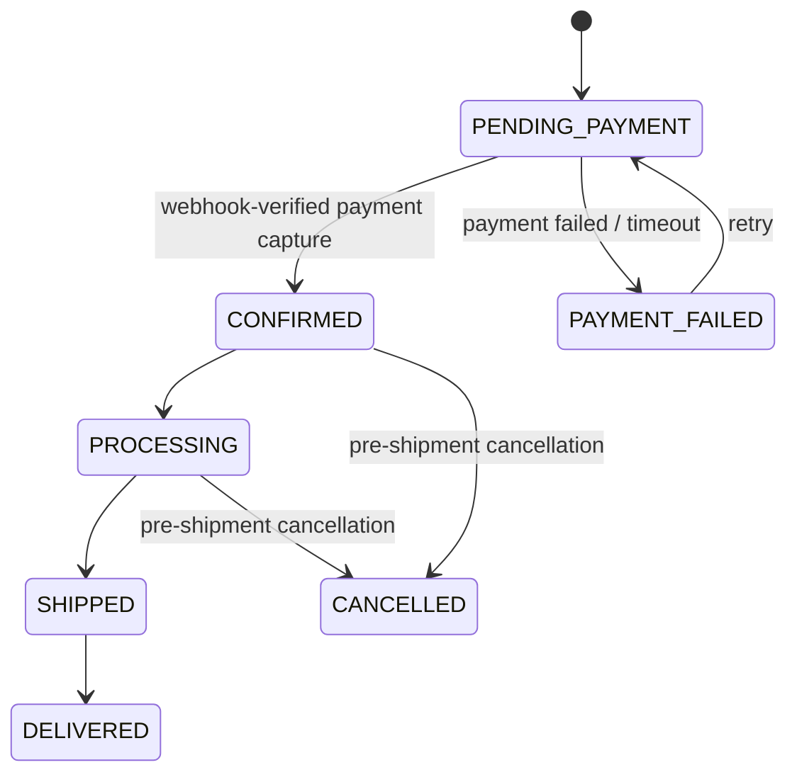
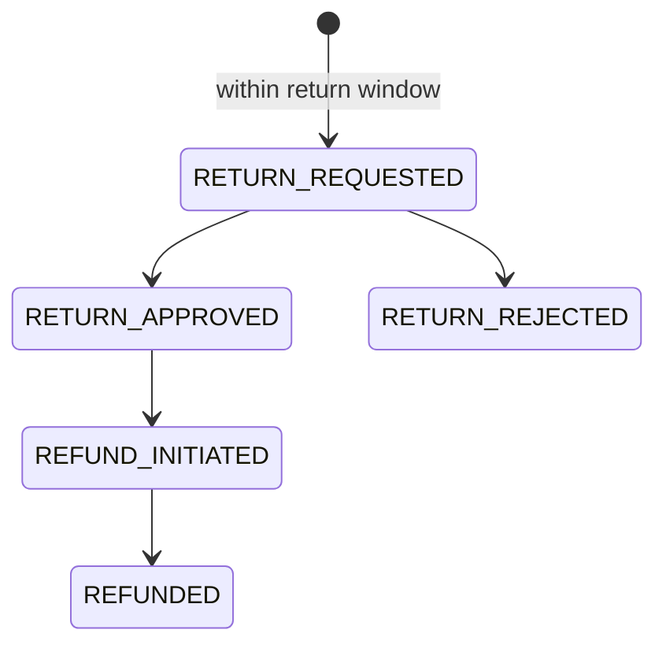

# Woobe E-commerce — Complete Architecture & Delivery Plan

Status: **Approved for implementation** — architecture reviewed, decisions locked, ready to hand to Claude Code.

---

## 1. Locked Decisions

| Decision | Choice | Rationale |
|---|---|---|
| Payment gateway | **Razorpay** | Native UPI/cards/net banking/COD support, strong India webhook + Orders API, standard choice for INR checkout |
| Warehouse model | **Single warehouse** | Simplest correct model for launch; schema designed so multi-warehouse is an additive change later, not a rewrite |
| Build approach | **Full scope, 4 weeks** | All documented domains built in sequence; see §6 for week-by-week order and the contingency rule if something slips |

---

## 2. Architecture Recap (unchanged from prior review)

```
Cloudflare
    |
Next.js (web + admin)
    |
API (Node.js/Express, modular monolith, Clean Architecture)
    |
PostgreSQL (Prisma) + Redis + BullMQ
    |
S3/Cloudinary (media)
```

pnpm monorepo: `apps/{web,admin,api}` + `packages/{database,types,validation,ui,config,utils}`. Modules: `auth, users, products, categories, collections, pricing, inventory, cart, wishlist, coupons, orders, payments, shipping, reviews, returns, refunds, notifications, admin`.

This section is intentionally brief — the full baseline (pricing formula, security list, SEO requirements, testing strategy, GST scope, etc.) from the original architecture brief stands as-is and isn't repeated here.

---

## 3. Gap-Closing Decisions (new ADRs)

### ADR-010: Module Boundary Enforcement
**Decision:** Single Postgres database, single Prisma schema — but each backend module gets its own repository layer, and **only that module's repository file may import the Prisma models it owns**. Enforced with `dependency-cruiser` (or `eslint-plugin-boundaries`) rules checked in CI, not just convention.
**Consequence:** If a module later needs to be extracted into its own service, the repository layer is already the seam — no cross-module direct DB access to untangle.
**Future option:** If/when extraction actually happens, migrate that module's tables to a separate Postgres schema first (schema-per-domain), then a separate database. Not needed at launch.

### ADR-011: Guest Cart & Session Strategy
**Decision:** Cart is **not** stored in Redis as source of truth. A signed, httpOnly cookie holds a `cart_id` (UUID); cart + cart_items live in Postgres. On login, the guest `cart_id` merges into the user's existing cart (union items, prefer higher quantity on conflict), and the merged cart is **re-validated against live stock** before being shown — a guest cart + account cart combined can exceed available quantity for a low-stock variant, so this isn't optional. Redis is reserved for hot-path use only: session tokens, rate limiting, inventory reservation locks/TTLs.
**Rationale:** Cart survives across devices once a guest logs in, and Postgres gives you transactional recalculation (weight → price → tax) in the same place order creation already happens — no dual-write consistency problem between Redis and Postgres.

### ADR-012: Catalogue Search & Filtering (pre-OpenSearch)
**Decision:** Postgres handles search/filtering at launch:
- B-tree indexes on `category_id`, `price`, `created_at`
- Composite index on `(category_id, price)` for the common "category + price range" filter path
- `pg_trgm` GIN index on `product_name` for fuzzy/partial search
**Explicit trigger to introduce OpenSearch/Meilisearch (per original doc's "future scaling" section):** catalogue exceeds ~50k products, OR filter/search p95 latency exceeds 300ms, OR the business needs typo-tolerant/faceted search UX. Not before.

### ADR-013: CI/CD & Migration Safety
**Decision:** GitHub Actions on every PR: lint → typecheck → unit + integration tests → `prisma migrate diff` check (destructive migrations require an explicit `--accept-data-loss` flag reviewed by a human, never auto-applied). Deploy pipeline runs `prisma migrate deploy` as a pre-deploy step, gated by a staging environment pass before production. All migrations follow **expand-contract**: add new column/table → backfill → switch reads → drop old column, never a single breaking migration — this keeps deploys zero-downtime.

### ADR-014: Payment Integration — Razorpay
**Decision:** Use Razorpay Orders API for payment creation, Razorpay Checkout on the client, and Razorpay webhooks for authoritative payment confirmation (never trust the client-side success callback alone).
- Store `razorpay_order_id`, `razorpay_payment_id`, `razorpay_signature` per payment attempt.
- Webhook handler verifies `X-Razorpay-Signature` against the webhook secret before processing.
- Enforce a unique constraint on `(provider, event_id)` to dedupe retried webhook deliveries.
- Order moves to `CONFIRMED` only after webhook-verified payment capture, not after the client redirect.

### ADR-015: Inventory & Warehouse Model
**Decision:** Single warehouse at launch. `inventory` table is keyed by `variant_id` with `quantity_available` / `quantity_reserved`, and includes a `warehouse_id` column defaulted to a single seeded warehouse row (not omitted). This makes multi-warehouse later an **additive** change (add rows, add allocation logic) rather than a schema rewrite.
Reservation on checkout: `SELECT ... FOR UPDATE` on the variant's inventory row inside the checkout transaction, released on payment failure/timeout via a BullMQ delayed job.

### ADR-016: Card Data / PCI Policy
**Decision:** No card, UPI, or bank credential data is ever received, processed, or stored on Woobe's servers. Razorpay Checkout (hosted/embedded) handles all sensitive payment input; Woobe stores only Razorpay's returned identifiers and the RBI-mandated tokenized references where applicable. This is a hard rule, not a preference — add it to `DEVELOPMENT_RULES.md` alongside the "never trust the client for price" rule.

### ADR-017: Caching Strategy
**Decision:** Three layers, each with a clear invalidation trigger, not a blanket TTL:
- **Cloudflare CDN** — static assets and SSG/ISR HTML for product/category pages, purged via cache-tag when the underlying product/category is edited.
- **Next.js ISR** — product detail, listing, and homepage sections (new arrivals, best sellers, featured collections), invalidated via `revalidateTag`/`revalidatePath` on admin write, not on a timer.
- **Redis (read-through)** — session tokens, rate-limit counters, inventory reservation TTL locks, and the admin ₹/kg default rate + per-product rate overrides for *display* purposes. Short TTL (30–60s) as a backstop; explicit bust on write is the primary mechanism.

**Hard rule:** nothing that feeds the authoritative price, stock, or payment decision at transaction time is ever served from cache. Checkout pricing and inventory reservation always read Postgres live, inside the transaction (ADR-015). Caching a rate for display is fine; caching it for the checkout calculation itself would reintroduce the exact stale-data risk the rest of this architecture exists to prevent.

### ADR-018: Auth Strategy
**Decision:** Custom auth for launch — JWT (short-lived access token + rotating refresh token, refresh token in httpOnly secure cookie) with bcrypt password hashing. Not Auth0, despite the plugin being installed — avoids per-MAU cost at ecommerce scale and keeps auth logic in-repo where the rest of the RBAC/session rules already live.
**Forward compatibility:** Auth credentials live in their own table (`auth_credentials`, keyed to `user_id`, with a `method` column) rather than a password column on `User` directly. This means mobile OTP login (the planned future addition) is an additive new row type later, not a schema migration that touches the `User` table.

### ADR-019: Frontend Data Access Pattern
**Decision:** `apps/web` and `apps/admin` never import `packages/database` or query Postgres directly — not even from Next.js Server Components/Server Actions as a performance shortcut. All data access, including SSR, goes through `apps/api` over HTTP.
**Rationale:** Keeps every business rule (pricing, stock, tax, RBAC) enforced in exactly one place — the frontend, including its server-rendering process, is still a client relative to the API. Also keeps ADR-010's module-extraction seam intact: if the frontend could read Prisma directly, extracting a module later means hunting down scattered direct DB reads across the frontend too, not just the API.
**Consequence:** SSR adds one internal network hop (Next.js server → API) instead of an in-process DB call. Negligible at single-region scale; if it ever matters, the fix is a read-through cache at the API layer (ADR-017), not a hole in the boundary.

### ADR-020: Shared Validation & Type Contracts
**Decision:** `packages/validation` holds one Zod schema per request shape (register, checkout, etc.), used on **both** sides — `apps/web` forms validate client-side with the same schema `apps/api` uses server-side (via a `validate` middleware). TypeScript types are derived from the schemas (`z.infer<typeof Schema>`) in `packages/types` rather than hand-written twice.
**Rationale:** Directly targets the "build backend and frontend together to minimize API bugs" goal — a changed field becomes a compile error everywhere it's used, not a silent runtime mismatch discovered in QA.

---

## 4. Order, Return & Refund State Machines (finalized)

**Correction from the previous draft:** Return/Refund states were originally folded into `Order.status`. That's wrong — returns are frequently partial (2 of 3 items), so they can't be represented as a single order-level status. They're modeled as their own entity, item-level, linked to the order — matching what the original brief's §8/§9 actually asked for.

**Order lifecycle** (`Order.status` — unchanged, matches the original brief exactly):



**Return/Refund lifecycle** (separate `Return` entity, item-level, `order_id` foreign key — order stays `DELIVERED`, gains a denormalized `has_active_return` flag for admin filtering only):



Exchanges follow the same Return sub-flow but resolve to a new Order linked via `exchange_of_order_id` instead of a Refund. Refund operations remain idempotent per the original brief's §9 — same `(provider, event_id)`-style dedup pattern as payment webhooks (ADR-014), applied to refund confirmations.

---

## 5. Definition of Done (what "bug-free" actually means here)

A module isn't done until all of these are true — this is the checklist Claude Code should run against before marking a module complete:

- Zero TypeScript errors, zero ESLint boundary violations (ADR-010)
- Unit tests pass for all pricing, tax, and state-transition logic
- Integration tests pass for the module's transactional flows
- The four mandatory concurrency tests pass where applicable: duplicate checkout, duplicate webhook, concurrent inventory purchase, concurrent coupon use
- `security-guidance` plugin flags nothing unresolved on the module's diff
- `code-review` plugin pass on the PR before merge
- No `console.log`/secrets/PII in logs (spot-checked against the observability rules)
- Mobile viewport (375px) verified via `chrome-devtools-mcp`, not just desktop

---

## 6. Four-Week Delivery Plan (full scope, sequenced by financial risk)

**Week 1 — Foundation**
Monorepo + workspace config, full Prisma schema (all domains from day one, even if some tables aren't used until week 3–4), auth module, CI pipeline (ADR-013), shared packages (`types`, `validation`, `ui`, `config`, `utils`), design tokens + base mobile-first layout (via `frontend-design`).

**Week 2 — Catalogue, Pricing, Cart**
Products/variants/categories/collections, weight-based pricing engine (unit-tested against the spec formula), product listing + detail pages (SSR/ISR), search/filter indexes (ADR-012), cart with server-side recalculation (ADR-011), wishlist.

**Week 3 — Checkout, Payments, Inventory, Shipping (highest financial risk — do not compress this week)**
Checkout flow, inventory reservation + locking (ADR-015), Razorpay integration + webhook handling + idempotency (ADR-014), coupon validation/concurrency, order creation, GST calculation, order state machine, shipping module (rate calculation + delivery estimate — this feeds the cart's grand total, so it belongs here, not week 4), core transactional notifications only (order confirmed, payment failed — minimal BullMQ jobs, not the full notification system), basic admin order view.

**Week 4 — Returns/Refunds, Full Notifications, SEO, Hardening**
Returns/exchange/refund flows (Return entity per §4, item-level), remaining BullMQ notification jobs (shipped/delivered updates, marketing), admin dashboard completion, SEO (sitemap, structured data, OpenGraph, canonical URLs), observability wiring, full E2E + concurrency suite, Core Web Vitals pass, security review, staging → production deploy.

**Contingency rule:** if week 3 runs long, the item to cut first is returns/refunds depth (ship a manual/admin-only refund path, automate later) — never checkout correctness or payment idempotency. Those two are non-negotiable regardless of schedule pressure.

---

## 7. Risks Carried Forward

- **Full-scope-in-4-weeks is aggressive even with AI assistance.** Mitigated by the sequencing above (money-critical paths first) and the contingency rule, not by hoping nothing slips.
- **Module boundaries are lint-enforced, not database-enforced.** Acceptable at single-DB scale; revisit if/when a module is extracted.
- **Single warehouse today** means multi-warehouse allocation logic doesn't exist yet — schema supports adding it, code doesn't.

---

## 8. Next Immediate Step

Feed this plan + the original architecture brief to Claude Code as the implementation baseline, starting with Week 1. Do not let it skip ahead to checkout/payments code before the schema and auth foundation are in place — the whole point of sequencing by financial risk is that later weeks depend on earlier ones being correct.