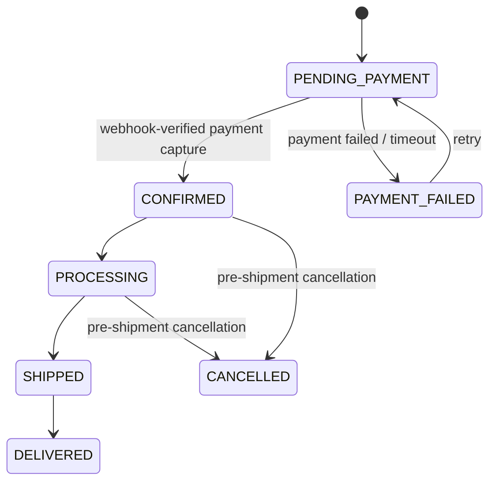
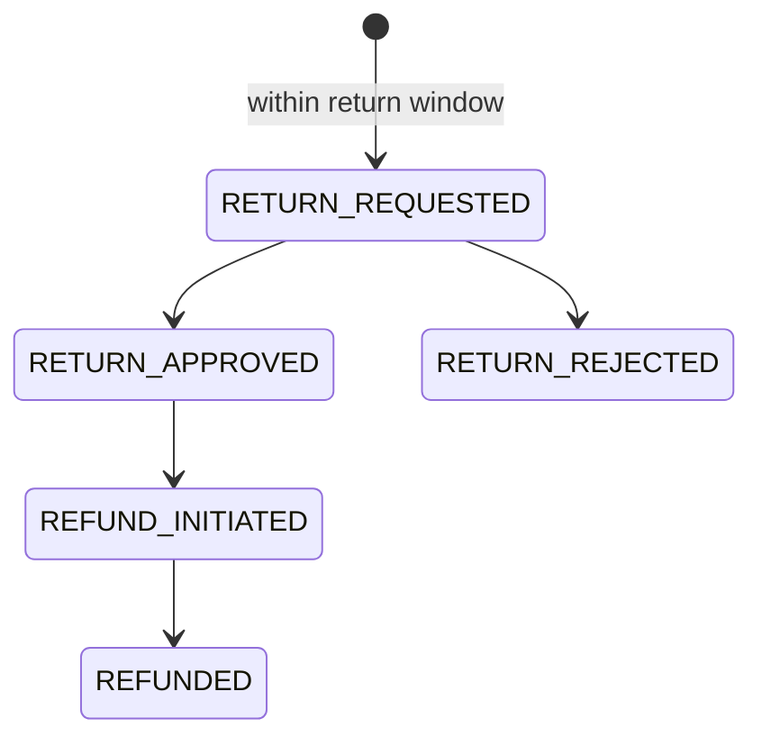

# Woobe E-commerce — Complete Architecture & Delivery Plan

Status: **Approved for implementation** — architecture reviewed, decisions locked, ready to hand to Claude Code.

---

## 1. Locked Decisions

| Decision | Choice | Rationale |
|---|---|---|
| Payment gateway | **Razorpay** | Native UPI/cards/net banking/COD support, strong India webhook + Orders API, standard choice for INR checkout |
| Warehouse model | **Single warehouse** | Simplest correct model for launch; schema designed so multi-warehouse is an additive change later, not a rewrite |
| Build approach | **Full scope, 4 weeks** | All documented domains built in sequence; see §6 for week-by-week order and the contingency rule if something slips |

---

## 2. Architecture Recap (unchanged from prior review)

```
Cloudflare
    |
Next.js (web + admin)
    |
API (Node.js/Express, modular monolith, Clean Architecture)
    |
PostgreSQL (Prisma) + Redis + BullMQ
    |
S3/Cloudinary (media)
```

pnpm monorepo: `apps/{web,admin,api}` + `packages/{database,types,validation,ui,config,utils}`. Modules: `auth, users, products, categories, collections, pricing, inventory, cart, wishlist, coupons, orders, payments, shipping, reviews, returns, refunds, notifications, admin`.

This section is intentionally brief — the full baseline (pricing formula, security list, SEO requirements, testing strategy, GST scope, etc.) from the original architecture brief stands as-is and isn't repeated here.

---

## 3. Gap-Closing Decisions (new ADRs)

### ADR-010: Module Boundary Enforcement
**Decision:** Single Postgres database, single Prisma schema — but each backend module gets its own repository layer, and **only that module's repository file may import the Prisma models it owns**. Enforced with `dependency-cruiser` (or `eslint-plugin-boundaries`) rules checked in CI, not just convention.
**Consequence:** If a module later needs to be extracted into its own service, the repository layer is already the seam — no cross-module direct DB access to untangle.
**Future option:** If/when extraction actually happens, migrate that module's tables to a separate Postgres schema first (schema-per-domain), then a separate database. Not needed at launch.

### ADR-011: Guest Cart & Session Strategy
**Decision:** Cart is **not** stored in Redis as source of truth. A signed, httpOnly cookie holds a `cart_id` (UUID); cart + cart_items live in Postgres. On login, the guest `cart_id` merges into the user's existing cart (union items, prefer higher quantity on conflict), and the merged cart is **re-validated against live stock** before being shown — a guest cart + account cart combined can exceed available quantity for a low-stock variant, so this isn't optional. Redis is reserved for hot-path use only: session tokens, rate limiting, inventory reservation locks/TTLs.
**Rationale:** Cart survives across devices once a guest logs in, and Postgres gives you transactional recalculation (weight → price → tax) in the same place order creation already happens — no dual-write consistency problem between Redis and Postgres.

### ADR-012: Catalogue Search & Filtering (pre-OpenSearch)
**Decision:** Postgres handles search/filtering at launch:
- B-tree indexes on `category_id`, `price`, `created_at`
- Composite index on `(category_id, price)` for the common "category + price range" filter path
- `pg_trgm` GIN index on `product_name` for fuzzy/partial search
**Explicit trigger to introduce OpenSearch/Meilisearch (per original doc's "future scaling" section):** catalogue exceeds ~50k products, OR filter/search p95 latency exceeds 300ms, OR the business needs typo-tolerant/faceted search UX. Not before.

### ADR-013: CI/CD & Migration Safety
**Decision:** GitHub Actions on every PR: lint → typecheck → unit + integration tests → `prisma migrate diff` check (destructive migrations require an explicit `--accept-data-loss` flag reviewed by a human, never auto-applied). Deploy pipeline runs `prisma migrate deploy` as a pre-deploy step, gated by a staging environment pass before production. All migrations follow **expand-contract**: add new column/table → backfill → switch reads → drop old column, never a single breaking migration — this keeps deploys zero-downtime.

### ADR-014: Payment Integration — Razorpay
**Decision:** Use Razorpay Orders API for payment creation, Razorpay Checkout on the client, and Razorpay webhooks for authoritative payment confirmation (never trust the client-side success callback alone).
- Store `razorpay_order_id`, `razorpay_payment_id`, `razorpay_signature` per payment attempt.
- Webhook handler verifies `X-Razorpay-Signature` against the webhook secret before processing.
- Enforce a unique constraint on `(provider, event_id)` to dedupe retried webhook deliveries.
- Order moves to `CONFIRMED` only after webhook-verified payment capture, not after the client redirect.

### ADR-015: Inventory & Warehouse Model
**Decision:** Single warehouse at launch. `inventory` table is keyed by `variant_id` with `quantity_available` / `quantity_reserved`, and includes a `warehouse_id` column defaulted to a single seeded warehouse row (not omitted). This makes multi-warehouse later an **additive** change (add rows, add allocation logic) rather than a schema rewrite.
Reservation on checkout: `SELECT ... FOR UPDATE` on the variant's inventory row inside the checkout transaction, released on payment failure/timeout via a BullMQ delayed job.

### ADR-016: Card Data / PCI Policy
**Decision:** No card, UPI, or bank credential data is ever received, processed, or stored on Woobe's servers. Razorpay Checkout (hosted/embedded) handles all sensitive payment input; Woobe stores only Razorpay's returned identifiers and the RBI-mandated tokenized references where applicable. This is a hard rule, not a preference — add it to `DEVELOPMENT_RULES.md` alongside the "never trust the client for price" rule.

### ADR-017: Caching Strategy
**Decision:** Three layers, each with a clear invalidation trigger, not a blanket TTL:
- **Cloudflare CDN** — static assets and SSG/ISR HTML for product/category pages, purged via cache-tag when the underlying product/category is edited.
- **Next.js ISR** — product detail, listing, and homepage sections (new arrivals, best sellers, featured collections), invalidated via `revalidateTag`/`revalidatePath` on admin write, not on a timer.
- **Redis (read-through)** — session tokens, rate-limit counters, inventory reservation TTL locks, and the admin ₹/kg default rate + per-product rate overrides for *display* purposes. Short TTL (30–60s) as a backstop; explicit bust on write is the primary mechanism.

**Hard rule:** nothing that feeds the authoritative price, stock, or payment decision at transaction time is ever served from cache. Checkout pricing and inventory reservation always read Postgres live, inside the transaction (ADR-015). Caching a rate for display is fine; caching it for the checkout calculation itself would reintroduce the exact stale-data risk the rest of this architecture exists to prevent.

### ADR-018: Auth Strategy
**Decision:** Custom auth for launch — JWT (short-lived access token + rotating refresh token, refresh token in httpOnly secure cookie) with bcrypt password hashing. Not Auth0, despite the plugin being installed — avoids per-MAU cost at ecommerce scale and keeps auth logic in-repo where the rest of the RBAC/session rules already live.
**Forward compatibility:** Auth credentials live in their own table (`auth_credentials`, keyed to `user_id`, with a `method` column) rather than a password column on `User` directly. This means mobile OTP login (the planned future addition) is an additive new row type later, not a schema migration that touches the `User` table.
**Cookie policy correction:** the customer `refresh_token` cookie is `SameSite=lax`, not `strict` as originally stated here — `strict` would drop the cookie on the first top-level navigation after an external redirect (e.g. returning from Razorpay's payment page), breaking the session exactly when it matters most. `lax` is correct for a storefront cookie. The separate `admin_refresh_token` (ADR-024/025) uses `SameSite=strict` instead — staff sessions have no legitimate cross-site entry point, so the tighter setting costs nothing for a higher-privilege session.

### ADR-019: Frontend Data Access Pattern
**Decision:** `apps/web` and `apps/admin` never import `packages/database` or query Postgres directly — not even from Next.js Server Components/Server Actions as a performance shortcut. All data access, including SSR, goes through `apps/api` over HTTP.
**Rationale:** Keeps every business rule (pricing, stock, tax, RBAC) enforced in exactly one place — the frontend, including its server-rendering process, is still a client relative to the API. Also keeps ADR-010's module-extraction seam intact: if the frontend could read Prisma directly, extracting a module later means hunting down scattered direct DB reads across the frontend too, not just the API.
**Consequence:** SSR adds one internal network hop (Next.js server → API) instead of an in-process DB call. Negligible at single-region scale; if it ever matters, the fix is a read-through cache at the API layer (ADR-017), not a hole in the boundary.

### ADR-020: Shared Validation & Type Contracts
**Decision:** `packages/validation` holds one Zod schema per request shape (register, checkout, etc.), used on **both** sides — `apps/web` forms validate client-side with the same schema `apps/api` uses server-side (via a `validate` middleware). TypeScript types are derived from the schemas (`z.infer<typeof Schema>`) in `packages/types` rather than hand-written twice.
**Rationale:** Directly targets the "build backend and frontend together to minimize API bugs" goal — a changed field becomes a compile error everywhere it's used, not a silent runtime mismatch discovered in QA.

### ADR-021: Weight-Based Shipping & Minimum Order Threshold
**Decision:** Checkout requires a minimum cart weight, and free delivery unlocks at a higher weight threshold — both **admin-configurable** (ADR-023), not hardcoded. Seeded defaults: 1,000g minimum to checkout, 1,500g free-delivery threshold, with a standard shipping fee applied between the two (fee amount also admin-configurable — see `DECISIONS_PENDING.md` for the seeded starting value).
**Resolves:** an inconsistency between two reference mockups — one showed ₹999 value-based free shipping, the other showed a 1.5kg/1kg weight-based rule. Weight-based wins as the underlying mechanic; it's consistent with Woobe's "fashion, by weight" pricing model end to end.
**Implementation:** thresholds and fee live in the `ShippingRule` settings row (`shipping` module), read live at checkout time — never hardcoded, never computed client-side. The `cart` module validates against current `ShippingRule` values.

### ADR-022: UI Component Library & Design System Stack
**Decision:**
- **shadcn/ui** (generated into `packages/ui`) as the component base, on **Base UI** primitives rather than Radix — Radix's maintenance pace has slowed since its acquisition by WorkOS; shadcn/ui now supports Base UI as an alternative primitive layer, and it's the more actively maintained option going into this build.
- **Tailwind CSS** for styling — already implied by `frontend-design` plugin conventions.
- **Motion** (the current name for what was Framer Motion — package is `motion`, imported from `motion/react`, not the old `framer-motion` name) for micro-interactions, scroll-reveal, and page transitions.
- **shadcn/ui's Carousel** (Embla Carousel underneath) for product rails, hero slider, and image thumbnails.
- **react-hook-form + Zod resolver** for forms — already required by ADR-020.
- **sonner** for toasts, **lucide-react** for icons.
**Rationale:** everything here is Tailwind-native and composes with the `packages/ui` token system (`ARCHITECTURE.md` §4.1) instead of fighting it — nothing here is a pre-styled/opinionated kit that would fight the custom rose/blush brand direction. Full design spec lives in `UI_DESIGN_PLAN.md`.

### ADR-023: Admin-Configurable Business Settings
**Decision:** Operational parameters that legitimately change over time — default ₹/kg rate, GST tax slabs, minimum order weight, free-delivery threshold, standard shipping fee — are **runtime-editable by the super admin role**, not hardcoded constants, env vars, or seed values meant to be "swapped before launch." They live in the database (`PricingSetting`, `GstSlab`, `ShippingRule`) behind an admin-only settings API, with a corresponding admin UI page — so the business can adjust them without a code deploy.
**Correction to earlier framing:** `DECISIONS_PENDING.md`'s original framing — confirm one value, hardcode it — undersold what these are. They're ongoing business levers, not one-time unknowns. Building them as static values now just means rebuilding this properly later.
**Non-negotiable even though it's configurable:** every order still snapshots the exact tax rule/version, rate, and thresholds used at checkout time (§6, "Price Snapshot" — this requirement already existed, it just wasn't wired to a settings source yet). Changing a setting tomorrow must never alter what an existing order shows today. Settings are mutable; snapshots are not.
**Seeded defaults (real-world-grounded, not arbitrary), editable from day one:**
- GST: tiered — 5% for per-piece price ≤ ₹2,500, 18% above (matches India's current GST structure, effective since the September 2025 reform)
- Default ₹/kg rate: ₹849/kg (matches the rate already shown in your own mockups)
- Minimum order weight: 1,000g · Free delivery threshold: 1,500g (ADR-021)
- Standard shipping fee (1,000g–1,499g band): ₹50 flat, pending your confirmation

### ADR-024: Role-Based Admin Access
**Correction from the previous draft:** the role list below is wrong — `accountant` and `support_staff` were invented, not contracted. The signed quotation (§6, "Role-Based Staff Access") already specifies the exact role split: **Super Admin, Order Processing Staff, Product Management Staff, Customer**. Building extra roles beyond this is scope the client isn't paying for. Fixed to match:

**Decision:** Replace the binary `customer`/`admin` role from Day 2 with the four contracted roles, each mapped to a permission set — not a linear hierarchy (the two staff roles have different permissions, neither is a subset of the other):
- `customer` — storefront only
- `super_admin` — everything: business settings (ADR-023 — GST, pricing rate, shipping thresholds), staff/role management, full product/order/inventory access, all reports. Per standard RBAC practice, assign this to the smallest possible set of people (Gokul & Sabir themselves) — broad-permission roles should have the fewest holders, not the most.
- `order_processing_staff` — order confirmation, packing, shipping, tracking, cancellations, returns and refunds. "Returns and refunds as permitted" (quotation's own phrasing) maps directly onto the Return/Refund state machine already in §4 — this role executes `RETURN_REQUESTED → RETURN_APPROVED → REFUND_INITIATED`, the state machine's approval step *is* the control, no separate monetary cap needed. Explicitly no catalog/pricing/settings access.
- `product_management_staff` — product creation/editing, images/360°, categories, pricing (per-product ₹/kg override — distinct from the *default* rate, which stays a Super Admin setting per ADR-023), weight, measurements, stock/SKU. Explicitly no order/payment access, no business settings.

**Implementation:** `role` enum on `User`, plus a small permission-mapping config (`role → Set<Permission>`, e.g. `MANAGE_SETTINGS`, `MANAGE_CATALOG`, `MANAGE_INVENTORY`, `MANAGE_ORDERS`, `MANAGE_STAFF`) that the RBAC middleware checks against — not a raw role-string comparison. This pattern (permissions mapped to roles, not hardcoded per-role checks) matches how e-commerce platforms actually handle this at scale — it's Shopify's own model — and means adding a role later is a config change, not a rebuild.
**Deliberately not built now:** an `accountant` role (finance-only, read access to orders/payments/GST reports) is a genuinely common pattern at scale — Shopify explicitly supports granting accountants store access — but it's outside this contract's scope. Worth knowing it's a natural, low-effort future addition (one more entry in the permission-mapping config) if the client wants it later; not worth building speculatively now.
**Retrofit note:** this replaces Day 2's already-shipped binary RBAC — see `PRE_DAY4_PATCH.md`.

### ADR-025: Cross-Module Dependency Resolution — Admin Cancellation Refunds & Audit Logging
**Context:** `payments` already imports `orders`' use-cases (to confirm/fail orders on webhook receipt). Routing the admin-triggered `CancelOrderUseCase`'s refund (§4 addendum) through `payments` or `refunds` directly from `orders` would create a circular import.
**Decision:**
- New leaf `audit` module — touches only Prisma, imports nothing else, exposes `recordAuditLogUseCase`. Every module can import it with zero cycle risk, since it never imports anything back. Owns `AdminAuditLog` (§15's admin-activity-logging requirement — this table didn't actually exist yet despite earlier docs assuming it did; corrected here).
- `refunds` module pulled forward from Week 4 (minimal build: `Refund` table, refund-creation use-case, Razorpay refund client) — this is contracted scope already (quotation §5: "cancel, return and refund"), resequenced earlier, not new scope. Only the admin-cancellation refund path is pulled forward; the full customer-initiated return request flow (`RETURN_REQUESTED → RETURN_APPROVED`, its own UI) stays Week 4.
- `refunds` writes `Payment.status` for refund transitions through one narrow method (`markPaymentRefunded()`), not open access to the `Payment` model — this is **split ownership by transition type** (`payments` owns capture-lifecycle writes, `refunds` owns refund-lifecycle writes to the same table), not a blanket boundary exception. `orders`' `CancelOrderUseCase` calls `refunds` only, never `payments` directly.
- Refund failure (gateway error) doesn't block the cancellation — inventory releases and the order cancels regardless; the failure is recorded on the `Refund` row for manual follow-up rather than surfaced as a request-level error. COD orders correctly trigger no gateway call, since nothing was captured pre-delivery.

---

## 4. Order, Return & Refund State Machines (finalized)

**Correction from the previous draft:** Return/Refund states were originally folded into `Order.status`. That's wrong — returns are frequently partial (2 of 3 items), so they can't be represented as a single order-level status. They're modeled as their own entity, item-level, linked to the order — matching what the original brief's §8/§9 actually asked for.

**Order lifecycle** (`Order.status` — unchanged, matches the original brief exactly):



**Return/Refund lifecycle** (separate `Return` entity, item-level, `order_id` foreign key — order stays `DELIVERED`, gains a denormalized `has_active_return` flag for admin filtering only):



Exchanges follow the same Return sub-flow but resolve to a new Order linked via `exchange_of_order_id` instead of a Refund. Refund operations remain idempotent per the original brief's §9 — same `(provider, event_id)`-style dedup pattern as payment webhooks (ADR-014), applied to refund confirmations.

**Addendum — admin-triggered cancellation:** `CONFIRMED`/`PROCESSING` → `CANCELLED` (staff-initiated, via the admin order-management surface) must trigger a refund, not just release the inventory reservation — `CONFIRMED` means payment was already webhook-verified and captured, so cancelling without repaying leaves the customer having paid for a cancelled order. Route this through the same idempotent refund mechanism as a customer-initiated return, not a separate path.

**Addendum — shipment modeling:** `trackingNumber`/`carrier`/`shippedAt` live directly on `Order` rather than a separate `Shipment` table. This is a deliberate simplification for single-warehouse, single-package fulfillment (ADR-015) — the original brief's Order/Payment/Shipment/Return/Refund relationship still holds conceptually, this just collapses Shipment into Order's columns rather than a joined table. Forecloses split-shipment scenarios without a later migration; acceptable trade-off at current scale, worth revisiting if multi-package fulfillment becomes real.

---

## 5. Definition of Done (what "bug-free" actually means here)

A module isn't done until all of these are true — this is the checklist Claude Code should run against before marking a module complete:

- Zero TypeScript errors, zero ESLint boundary violations (ADR-010)
- Unit tests pass for all pricing, tax, and state-transition logic
- Integration tests pass for the module's transactional flows
- The four mandatory concurrency tests pass where applicable: duplicate checkout, duplicate webhook, concurrent inventory purchase, concurrent coupon use
- `security-guidance` plugin flags nothing unresolved on the module's diff
- `code-review` plugin pass on the PR before merge
- No `console.log`/secrets/PII in logs (spot-checked against the observability rules)
- Mobile viewport (375px) verified via `chrome-devtools-mcp`, not just desktop

---

## 6. Four-Week Delivery Plan (full scope, sequenced by financial risk)

**Week 1 — Foundation**
Monorepo + workspace config, full Prisma schema (all domains from day one, even if some tables aren't used until week 3–4), auth module, CI pipeline (ADR-013), shared packages (`types`, `validation`, `ui`, `config`, `utils`), design tokens + base mobile-first layout (via `frontend-design`).

**Week 2 — Catalogue, Pricing, Cart**
Products/variants/categories/collections, weight-based pricing engine (unit-tested against the spec formula), product listing + detail pages (SSR/ISR), search/filter indexes (ADR-012), cart with server-side recalculation (ADR-011), wishlist.

**Week 3 — Checkout, Payments, Inventory, Shipping (highest financial risk — do not compress this week)**
Checkout flow, inventory reservation + locking (ADR-015), Razorpay integration + webhook handling + idempotency (ADR-014), coupon validation/concurrency, order creation, GST calculation, order state machine, shipping module (rate calculation + delivery estimate — this feeds the cart's grand total, so it belongs here, not week 4), core transactional notifications only (order confirmed, payment failed — minimal BullMQ jobs, not the full notification system), basic admin order view.

**Week 4 — Returns/Refunds, Full Notifications, SEO, Hardening**
Returns/exchange/refund flows (Return entity per §4, item-level), remaining BullMQ notification jobs (shipped/delivered updates, marketing), admin dashboard completion, SEO (sitemap, structured data, OpenGraph, canonical URLs), observability wiring, full E2E + concurrency suite, Core Web Vitals pass, security review, staging → production deploy.

**Contingency rule:** if week 3 runs long, the item to cut first is returns/refunds depth (ship a manual/admin-only refund path, automate later) — never checkout correctness or payment idempotency. Those two are non-negotiable regardless of schedule pressure.

---

## 7. Risks Carried Forward

- **Full-scope-in-4-weeks is aggressive even with AI assistance.** Mitigated by the sequencing above (money-critical paths first) and the contingency rule, not by hoping nothing slips.
- **Module boundaries are lint-enforced, not database-enforced.** Acceptable at single-DB scale; revisit if/when a module is extracted.
- **Single warehouse today** means multi-warehouse allocation logic doesn't exist yet — schema supports adding it, code doesn't.

---

## 8. Next Immediate Step

Feed this plan + the original architecture brief to Claude Code as the implementation baseline, starting with Week 1. Do not let it skip ahead to checkout/payments code before the schema and auth foundation are in place — the whole point of sequencing by financial risk is that later weeks depend on earlier ones being correct.